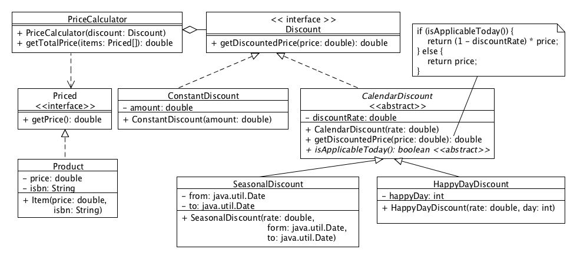

# Individual Assignment 4

In this assignment, you are going to implement and test a tool to manage priced products in a store. The design of this tool relies on the [strategy design pattern](https://sourcemaking.com/design_patterns/strategy). 

# Implementation

Your first task is to implement the tool following this given design:  

- A `ConstantDiscount` lowers the price by a constant amount.
- A `SeasonalDiscount` lowers the price by a given rate only if the date (today’s date) falls within the given season (from, and including, the from date and to, and excluding, the to date).
- A `HappyDayDiscount` lowers the price by a given rate only if the day of the week (today’s day of the week) is the same as the “happy day”. 
- The `getTotalPrice` method of `PriceCalculator` should have a `java.util.Collection` of `Priced` as a parameter.

Note that this exercise will be automarked, so you must use exactly the same class/method names and types as on the above diagram. Make sure that your implementation works with the given starter code and produces the required result. Finally, make sure that you follow the package structure given by the starter code. There is no need to create any additional package structure. 

# Testing

Your second task is to test your implementation. Your testing must follow the testing best practices seeing in class. 

